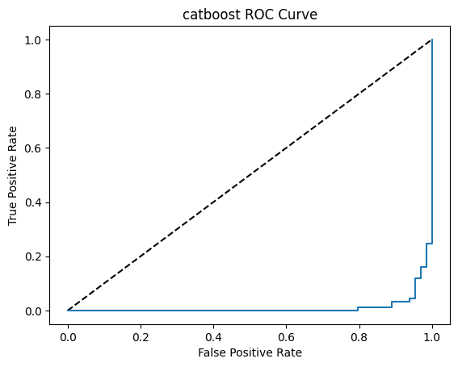
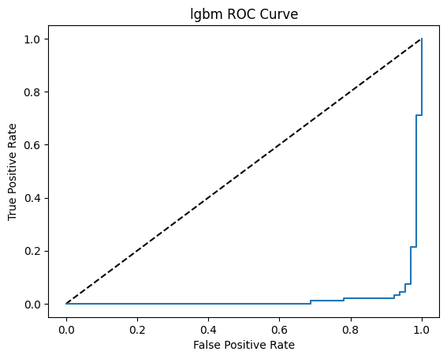
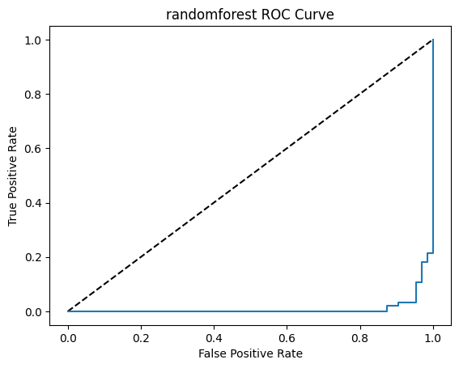
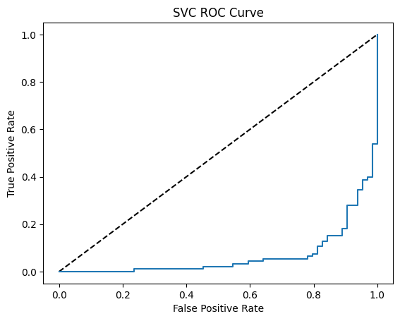
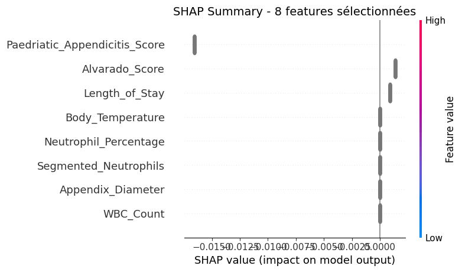
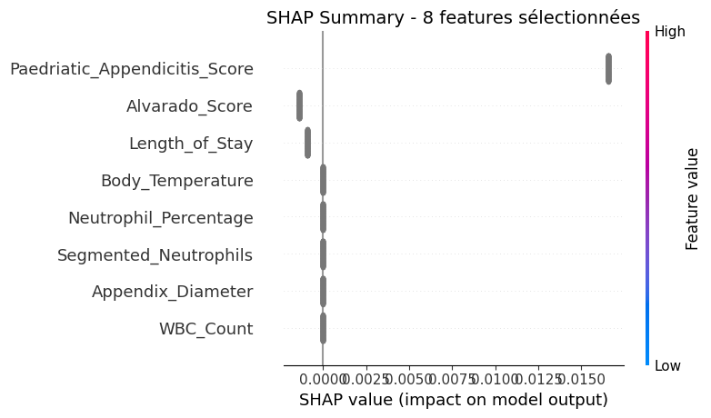

# Groupe_15_projet_5
 Hello welcome, hope you have a good day 

 here the **Debugging squad**'s
 Project of the Coding week

## Repository Structure

```
├── .github/workflows
│ └──ci.yml
├── app
│ └──app.py   #Interface deployed
├── models
│ ├── best_model_CatBoostClassifier.joblib
│ ├── best_model_LGBMClassifier.joblib
│ ├── best_model_RandomForestClassifier.joblib
│ └── best_model_SVC.joblib
├── notebook
│ └── coding_week_project_5.ipynb
├── src
│ ├── config.py
│ ├── data_loader.py
│ ├── data_processing.py
│ ├── evaluate_model.py
│ └── train_model.py
├── tests/ # Tests unitaires 
│ └──pytest.py
├──.gitattributes
├──.gitignore
├──README.md
└──requirements.txt

## 🩺 Clinical Decision-Support for Pediatric Appendicitis
Groupe_15_Projet_5

This repository hosts the project of **Group_15_Project_5**. Our objective is to develop a clinical decision-support application designed to assist pediatricians in accurately diagnosing appendicitis in children. By analyzing patient symptoms and clinical test results, the application provides data-driven insights to support medical professionals. Given the critical nature of this medical context, the tool aims to enhance diagnostic precision and optimize patient outcomes 


## Key Features

Key Features :
 Integration of data such as : **Length_of_Stay , Alvarado_Score , Appendix_Diameter, WBC_Count, Neutrophil_Percentage, Segmented_Neutrophils, Body_Temperature, Paedriatic_Appendicitis_Score**


## 🛠️ Tech Stack

* **Language:** Python 3.10
* **Data Science:** Pandas, Scikit-learn, Matplotlib
* **Explainability:** SHAP / LIME
* **Interface:** Streamlit 

🚀 Getting Started

### Prerequisites

Ensure you have Python installed. You can install the required dependencies using:

```bash
pip install -r requirements.txt

```

### Installation

1. Clone the repository:
```bash
git clone https://github.com/votre-compte/Groupe_15_projet_5.git

```


2. Navigate to the project directory:
```bash
cd Groupe_15_projet_5

```


3. Run the application:
```bash
python main.py

```

📊 Methodology


Our model is trained on   the dataset : https://archive.ics.uci.edu/dataset/938/regensburg+pediatric+appendicitis


⚠️ Medical Disclaimer
**This application is a decision-support tool and is NOT intended to replace professional medical judgment, diagnosis, or treatment. The final clinical decision remains the sole responsibility of the healthcare professional.**

👥 Contributors
Group 15 - [École Centrale Casablanca]

-Mame Lesse FAYE (punisher33201)
 
-Mariam KRISSE

-Sahar BELGHITH

-Marie-Reine SOGNON

-Cham Samuel Chedrack BOTI (LeSamCham)

### 🧠 Model Performance & Selection

To ensure the highest diagnostic accuracy, we evaluated multiple machine learning architectures. We prioritize **Sensitivity (Recall)**, as missing an appendicitis diagnosis in a pediatric patient carries a higher clinical risk than a false positive.

#### Evaluated Models

We trained and compared the following algorithms:

| Model | Primary Advantage |
| --- | --- |
| **CatBoost** | Excellent handling of categorical clinical features. |
| **LightGBM (LGBM)** | High performance and speed on tabular data. |
| **Random Forest** | Robustness and clear feature importance ranking. |
| **SVC** | Effective in high-dimensional feature spaces. |

#### Model Evaluation Strategy

We compare these models using a standardized test set to ensure reliability. The evaluation focuses on:

1. **Sensitivity (Recall):** Minimizing "false negatives" to avoid missing acute cases.
2. **Specificity:** Reducing "false positives" to prevent unnecessary medical interventions.
3. **Interpretability:** Using SHAP values to explain the contribution of each symptom to the final prediction.

#### MODEL'S RESULTS

 **CatBoost** 
 Score = 0.9426751592356688
AUC score = 0.9885752688172043

confusion's matrix :
[[90  3]
 [ 6 58]]

classification's report :
                 precision    recall  f1-score   support

   appendicitis       0.94      0.97      0.95        93
no appendicitis       0.95      0.91      0.93        64

       accuracy                           0.94       157
      macro avg       0.94      0.94      0.94       157
   weighted avg       0.94      0.94      0.94       157



 **LightGBM** 
 Score = 0.9554140127388535
AUC score = 0.9791666666666666

confusion's matrix :
[[91  2]
 [ 5 59]]

classification's report :
                 precision    recall  f1-score   support

   appendicitis       0.95      0.98      0.96        93
no appendicitis       0.97      0.92      0.94        64

       accuracy                           0.96       157
      macro avg       0.96      0.95      0.95       157
   weighted avg       0.96      0.96      0.96       157



 **Random Forest** 
Score = 0.9554140127388535
AUC score = 0.9899193548387097

confusion's matrix :
[[90  3]
 [ 4 60]]

classification's report :
                 precision    recall  f1-score   support

   appendicitis       0.96      0.97      0.96        93
no appendicitis       0.95      0.94      0.94        64

       accuracy                           0.96       157
      macro avg       0.95      0.95      0.95       157
   weighted avg       0.96      0.96      0.96       157



 **SVC(SVM)** 
 Score = 0.8789808917197452
AUC score = 0.9339717741935484

confusion's matrix :
[[88  5]
 [14 50]]

classification's report :
                 precision    recall  f1-score   support

   appendicitis       0.86      0.95      0.90        93
no appendicitis       0.91      0.78      0.84        64

       accuracy                           0.88       157
      macro avg       0.89      0.86      0.87       157
   weighted avg       0.88      0.88      0.88       157



*Note: The primary objective is to maximize Sensitivity to ensure no acute appendicitis cases are overlooked by the system.*

## **SHAP Explainability**

## 🔬 Model Explainability & Clinical Insights

To ensure our application is not a "black box," we utilized **SHAP (SHapley Additive exPlanations)** to interpret how our machine learning models arrive at a diagnosis. This is critical in a pediatric context where clinical trust is paramount.

## 🔍 The Clinical Imperative: ##

## Why Explainability Matters (SHAP Analysis) ##

Scenario: The Unjustified Loan Rejection

Imagine yourself as a bank customer using a complex Machine Learning model to decide whether to grant you a mortgage or not.

You enter your banking details and parameters and request a loan. The model generates an automatic response: "Rejected."
The first question that comes to your mind is "Why?"

You have the right to know the reasons for the rejection.
You approach a manager and he replies that these are the results of an algorithm, without being able to tell you the real reasons for the refusal...
This is obviously quite frustrating.

 It is when this quest for understanding the decision factors comes into play that **SHAP analysis** enters the picture.

### Key Findings from SHAP Analysis





Our analysis reveals that the models prioritize established clinical diagnostic protocols:

* **Dominance of Clinical Scores:** The **Paediatric Appendicitis Score (PAS)** and the **Alvarado Score** are the primary drivers of model output. This validates that our machine learning approach aligns with, and reinforces, standard medical diagnostic workflows.
* **Feature Redundancy:** Biological markers (such as `WBC_Count` and `Appendix_Diameter`) show lower individual SHAP values. This suggests that the information provided by these variables is often already captured within the aggregate clinical scores.
* **Model Divergence:** Our comparative analysis between different model architectures (CatBoost, LGBM, RF, SVC) highlights how different algorithms weigh these scores. For example, some models favor the PAS score while others prioritize the Alvarado score, illustrating the importance of choosing a model that minimizes bias toward a specific clinical tool.

### Clinical Interpretation

While clinical scores are foundational, our model uses these variables to refine the diagnostic threshold. By identifying the specific features that influence each prediction, we ensure that clinicians can understand the logic behind the application's suggestion, thereby facilitating **Shared Decision-Making**.

> **Note on Explainability:** We prioritize models that offer high transparency, ensuring that when the application flags a potential case of appendicitis, the contributing factors—such as specific symptom intensity or lab results—are clearly visible to the attending pediatrician.


---


